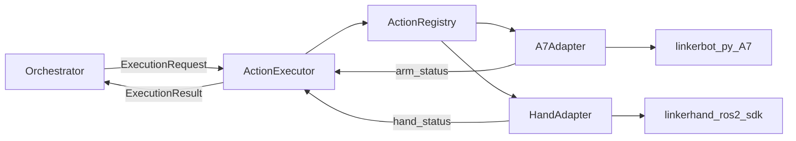

# SDK执行层任务规划（含 A7 与 robot_arm_web）

## 目标与边界
- 你负责 **执行层（SDK 与联动控制）**：把上层 `ExecutionRequest` 映射为“机械臂 A7 + 灵巧手”协同动作，并统一返回 `ExecutionResult`。
- 在既有 `robot_arm_web` 基础上增量改造，优先保证 `4/20` 前可演示闭环、可排障、可稳定联调。

## 已有代码资产（新增 A7 与上位机）
- 灵巧手 ROS2 SDK：[`/data/coding_pro/Robot_Box_folding/src/linkerhand-ros2-sdk`](/data/coding_pro/Robot_Box_folding/src/linkerhand-ros2-sdk)
- 上位机主入口（当前机械臂执行面）：[`/data/coding_pro/robot_arm_web/backend/app.py`](/data/coding_pro/robot_arm_web/backend/app.py)
- A7 双臂控制核心：[`/data/coding_pro/robot_arm_web/backend/group_controller.py`](/data/coding_pro/robot_arm_web/backend/group_controller.py)
- 笛卡尔执行与命令模型：[`/data/coding_pro/robot_arm_web/backend/motion_service.py`](/data/coding_pro/robot_arm_web/backend/motion_service.py)、[`/data/coding_pro/robot_arm_web/backend/motion_types.py`](/data/coding_pro/robot_arm_web/backend/motion_types.py)
- 轨迹与配置：[`/data/coding_pro/robot_arm_web/trajectories`](/data/coding_pro/robot_arm_web/trajectories)、[`/data/coding_pro/robot_arm_web/backend/config.py`](/data/coding_pro/robot_arm_web/backend/config.py)
- 项目目标与验收依据：[`/data/coding_pro/Robot_Box_folding/项目文档.pdf`](/data/coding_pro/Robot_Box_folding/项目文档.pdf)
- A7 官方 SDK 约束：[`A7 参考文档`](https://docs.linkerhub.work/sdk/zh-cn/reference/a7/index.html)

## 当前现状结论（用于规划）
- `robot_arm_web` 已稳定使用 `linkerbot-py` 控制 A7（`move_j`、`enable`、`emergency_stop` 等），但尚未接入灵巧手链路。
- 现有轨迹与执行模型主要覆盖双臂 14 关节，缺少“手”的模型、时序和状态回传。
- 项目文档要求的是抽象执行契约（`ExecutionRequest/ExecutionResult` + 错误码 + 后置验证），当前实现尚未完全落地该契约。

## A7 侧必须纳入的工程约束
- 构造与连通：每臂需明确 `side`、`interface_name`，并在初始化阶段处理在线检查失败与异常归类。
- 控制语义：默认 PP 模式；`enable()` 有短暂失能行为，必须体现在执行状态机和超时判定中。
- 坐标语义：明确 `world_frame`（`urdf`/`maestro`）与 `move_p/move_l` 的关系，避免上层 frame 语义漂移。
- 安全与生命周期：规范 `emergency_stop`、`disable`、`close`、`reset_error` 的调用顺序与失败回滚。
- 关节与姿态合法性：执行前做关节限位与参数合法性校验，避免将非法目标直接下发底层。

## 重新规划（按优先级）

### 阶段A：执行契约冻结（今天）
- 冻结统一数据结构：`ExecutionRequest`、`ExecutionResult`、错误码字典。
- 定义 `action_id` 命名与参数 schema（配置驱动，禁止散落硬编码）。
- 对齐文档验收字段：`run_id/step_id/action_id/decision/error_code` 必可追踪。

### 阶段B：A7 与手的适配分层（1天）
- 在 `robot_arm_web` 增加执行适配层：`A7Adapter`（复用 `GroupController`）与 `HandAdapter`（封装 `linkerhand-ros2-sdk` 调用）。
- 统一执行流程：参数校验 -> 设备可用性检查 -> 动作下发 -> 超时/中断 -> 结果归一化。
- 补齐 `safe_abort_action` 和 recover 钩子，明确“臂停+手停”一致性策略。

### 阶段C：联动动作注册与时序（1天）
- 建立 `ActionRegistry`：`action_id -> {arm_plan, hand_plan, sync_policy, timeout, postconditions}`。
- 扩展轨迹/动作模型支持“臂+手”同一步时序（并行、先臂后手、先手后臂三类）。
- 保持向后兼容：旧 14 轴轨迹仍可运行，新动作按注册表执行。

### 阶段D：黄金路径与验收（4/20前）
- 选 1 条纸箱折叠最小链路（3-5 原子动作）完成端到端。
- 完成失败场景验证：超时、SDK 异常、后置条件失败、动作不支持。
- 输出演示包：运行说明、错误码排查、回放样例与配置快照。

## 联调数据流（更新后）

## 里程碑对齐（你的执行线）
- `2026-04-17` 前：完成 A7/手适配层与动作注册表最小版本，单步验证通过。
- `2026-04-19` 前：完成与感知编排联调，保证执行契约稳定不再频繁变更。
- `2026-04-20` 前：完成可演示黄金路径，日志回放与故障定位材料齐全。

## 完成判定
- 任一 `action_id` 能输出结构化 `ExecutionResult`，且错误码稳定、可复现。
- 至少 1 条“机械臂+手”联动动作链可连续执行并通过后置验证。
- 上层联调无阻断性字段/语义不一致问题，出现异常可在日志中 5 分钟内定位到执行层。

## 代码分流与回迁约定
- 本轮开发固定在复制后的子模块：[`/data/coding_pro/Robot_Box_folding/robot_arm_web`](/data/coding_pro/Robot_Box_folding/robot_arm_web)。
- 变更追踪文档固定放在：[`/data/coding_pro/Robot_Box_folding/docs/UPSTREAM_DIFF.md`](/data/coding_pro/Robot_Box_folding/docs/UPSTREAM_DIFF.md)。
- 每次改动记录三项：改动文件、改动原因、是否需要回迁到原始 `robot_arm_web`。

## 依赖环境管理决策
- 默认使用 `uv` 管理 Python 依赖与虚拟环境（快、可复现、便于锁定版本）。
- `conda` 仅作为少数底层二进制库兜底方案（例如某些平台上 `pinocchio` 安装受限时）。
- Linux 优先路径：`uv` + `pip` 生态即可满足当前 A7 开发；除非遇到底层编译/ABI问题，再启用 `conda`。

## 遗漏补充（新增关注点）
- **控制源仲裁**：同一时刻只能有一个控制源（上层编排或上位机手动），防止并发下发导致动作打架。
- **标定与坐标契约**：冻结 `world_frame`、TCP 偏移、手安装位姿与相机标定版本，避免“视觉正确但执行偏移”。
- **联动安全看门狗**：动作总超时、单步重试上限、失败降级路径（中断/回安全位）需要显式策略。
- **启动与恢复流程**：定义冷启动、热重启、异常恢复顺序（先臂后手或先手后臂）并写入联调手册。
- **演示模式与实机模式切换**：保留 `mock` 开关，确保无硬件时也能回归接口链路。
- **性能预算**：为每步动作定义时延预算（请求处理、SDK执行、后置验证），防止端到端超时不可定位。

## 国强职责专项梳理（按项目文档分工）

### 你在文档中的核心职责
- 模块定位：`ActionExecutor` 与底层 SDK 对接负责人（机械臂 A7 + 灵巧手）。
- 核心产出：原子动作序列、动作注册表、标准化执行接口、执行错误码体系。
- 对外承诺：上层只传结构化请求，不直接耦合底层 SDK 细节。

### 你的明确交付物（建议落到仓库文件）
- `ExecutionRequest/ExecutionResult` 数据模型与字段说明（含 `run_id/step_id/action_id/timeout/postconditions`）。
- `action_id` 注册表（动作模板、默认参数、超时、`safe_abort_action`、后置条件）。
- 执行错误码清单与映射规则（A7 异常、手 SDK 异常、超时、后置验证失败）。
- 最小可演示联动链路（3-5 原子动作）及对应日志回放样例。
- 联调手册（启动顺序、异常恢复、急停策略、常见报错排查）。

### 按里程碑拆解你的日程
- `4/15` 前：完成设备与 SDK 打通（双臂 A7 + 手侧基础调用验证）。
- `4/17` 前：完成原子动作序列与单步调用验证（对应文档 M2）。
- `4/19` 前：完成与感知/编排联调，字段与错误码冻结。
- `4/20` 前：完成端到端闭环并具备回放证据（日志+配置快照+失败样例）。

### 目前还需要补充或调整的点（重点）
- 补一个“执行层接口冻结清单”：冻结后只允许增量字段，不做破坏性改名。
- 增一个“联动时序策略”规范：并行/先臂后手/先手后臂 的选择条件与超时处理。
- 增一个“急停一致性策略”：任一侧故障时，定义另一侧是否立即停机与回零策略。
- 明确 `robot_arm_web` 与 `linkerhand-ros2-sdk` 的进程边界与通信方式，避免临时拼接导致不稳定。
- 增加 2 组失败注入测试：`SDK_ERROR` 与 `ACTION_TIMEOUT`，确保演示前可复现并能自恢复或可控退出。

### 建议你优先推进的今日清单
- 先拉齐接口：和上层确认 `ExecutionRequest/ExecutionResult` 最终字段版本。
- 先做最小动作：选 1 条纸箱折叠黄金路径，先跑通再扩动作库。
- 先做可观测：把 `run_id/step_id/action_id/error_code` 日志贯通，确保问题可定位。

## 实施清单（第0天~第2天，文件级）

### 第0天：接口冻结与骨架落地
- 目标：先把“上层可调用”的统一执行入口搭出来，不追求动作全量。
- 修改建议：
  - [`/data/coding_pro/Robot_Box_folding/robot_arm_web/backend/motion_types.py`](/data/coding_pro/Robot_Box_folding/robot_arm_web/backend/motion_types.py)：新增/扩展 `ExecutionRequest`、`ExecutionResult`、错误码枚举。
  - [`/data/coding_pro/Robot_Box_folding/robot_arm_web/backend/motion_service.py`](/data/coding_pro/Robot_Box_folding/robot_arm_web/backend/motion_service.py)：增加统一 `execute_action(request)` 入口与结果归一化。
  - [`/data/coding_pro/Robot_Box_folding/robot_arm_web/backend/app.py`](/data/coding_pro/Robot_Box_folding/robot_arm_web/backend/app.py)：增加最小外部入口（Socket/HTTP 二选一）转发到 `execute_action`。
  - [`/data/coding_pro/Robot_Box_folding/docs/UPSTREAM_DIFF.md`](/data/coding_pro/Robot_Box_folding/docs/UPSTREAM_DIFF.md)：记录本日改动与回迁判断。
- 当天完成标准：
  - 能收一个最小 `ExecutionRequest` 并返回结构化 `ExecutionResult`。
  - 错误码至少覆盖：`SDK_ERROR`、`ACTION_TIMEOUT`、`UNSUPPORTED_ACTION`。

### 第1天：A7+手适配层与动作注册表
- 目标：把底层能力抽象为可组合动作，打通“动作名 -> 执行”。
- 修改建议：
  - 新增 [`/data/coding_pro/Robot_Box_folding/robot_arm_web/backend/adapters/a7_adapter.py`](/data/coding_pro/Robot_Box_folding/robot_arm_web/backend/adapters/a7_adapter.py)：封装 `GroupController` 常用动作与状态读取。
  - 新增 [`/data/coding_pro/Robot_Box_folding/robot_arm_web/backend/adapters/hand_adapter.py`](/data/coding_pro/Robot_Box_folding/robot_arm_web/backend/adapters/hand_adapter.py)：封装手侧调用（先保留最小接口，真实调用后接）。
  - 新增 [`/data/coding_pro/Robot_Box_folding/robot_arm_web/backend/action_registry.yaml`](/data/coding_pro/Robot_Box_folding/robot_arm_web/backend/action_registry.yaml)：定义 `action_id -> arm_plan/hand_plan/sync_policy/timeout/postconditions`。
  - 在 [`/data/coding_pro/Robot_Box_folding/robot_arm_web/backend/motion_service.py`](/data/coding_pro/Robot_Box_folding/robot_arm_web/backend/motion_service.py) 接入注册表解析与适配层路由。
  - 在 [`/data/coding_pro/Robot_Box_folding/docs/UPSTREAM_DIFF.md`](/data/coding_pro/Robot_Box_folding/docs/UPSTREAM_DIFF.md) 追加记录。
- 当天完成标准：
  - 至少 2 个 `action_id` 可执行（例如 `reach_pregrasp`、`hand_close_soft`）。
  - 支持一种联动策略（建议先“先臂后手”）。

### 第2天：黄金路径、安全与可观测
- 目标：把最小演示链路跑通并可定位问题。
- 修改建议：
  - [`/data/coding_pro/Robot_Box_folding/robot_arm_web/backend/motion_service.py`](/data/coding_pro/Robot_Box_folding/robot_arm_web/backend/motion_service.py)：加入超时看门狗、`safe_abort_action`、失败降级路径。
  - [`/data/coding_pro/Robot_Box_folding/robot_arm_web/backend/group_controller.py`](/data/coding_pro/Robot_Box_folding/robot_arm_web/backend/group_controller.py)：补充必要状态读取/急停一致性调用（尽量少改核心老逻辑）。
  - 新增 [`/data/coding_pro/Robot_Box_folding/robot_arm_web/tests/test_execution_contract.py`](/data/coding_pro/Robot_Box_folding/robot_arm_web/tests/test_execution_contract.py)：接口级测试（非法参数、超时、不支持动作）。
  - 新增 [`/data/coding_pro/Robot_Box_folding/robot_arm_web/tests/test_action_registry.py`](/data/coding_pro/Robot_Box_folding/robot_arm_web/tests/test_action_registry.py)：注册表解析与最小联动流程测试。
  - 在 [`/data/coding_pro/Robot_Box_folding/docs/UPSTREAM_DIFF.md`](/data/coding_pro/Robot_Box_folding/docs/UPSTREAM_DIFF.md) 记录风险与回迁建议。
- 当天完成标准：
  - 1 条 3-5 步黄金动作链完整执行（含失败回传与日志）。
  - 日志可追踪 `run_id/step_id/action_id/error_code`，可回放复盘。

## 执行约束（避免返工）
- 优先新增文件与新增模块，尽量少侵入历史核心路径。
- 旧轨迹与旧接口保持可用，联动能力通过新入口逐步切流。
- 任何接口字段变更先更新文档与注册表，再改代码，避免联调期漂移。

## 第三步微调（已确认：L6 + CAN + Python直连）

### 选型结论
- 灵巧手采用 **L6 + CAN**。
- 接入方式采用 **`robot_arm_web` 进程内 Python 直连**（`HandAdapter` 直接调用 `LinkerHandApi`），不走 ROS2 bridge。
- 目标是与当前 A7 机械臂链路保持一致的工程风格，优先确保联动闭环与交付节奏。

### 仅针对第三步的实施范围
- [`/data/coding_pro/Robot_Box_folding/robot_arm_web/backend/adapters/hand_adapter.py`](/data/coding_pro/Robot_Box_folding/robot_arm_web/backend/adapters/hand_adapter.py)
  - 将 mock 逻辑替换为 `LinkerHandApi(hand_joint="L6", can=<hand_can>, hand_type=<left|right>)` 直连调用。
  - 提供 `is_ready()`、`execute_hand_plan()`、`telemetry()` 三个稳定接口。
- [`/data/coding_pro/Robot_Box_folding/robot_arm_web/backend/config.py`](/data/coding_pro/Robot_Box_folding/robot_arm_web/backend/config.py)
  - 新增手侧配置项：`HAND_ENABLE`、`HAND_TYPE`、`HAND_JOINT="L6"`、`HAND_CAN`。
- [`/data/coding_pro/Robot_Box_folding/robot_arm_web/backend/motion_service.py`](/data/coding_pro/Robot_Box_folding/robot_arm_web/backend/motion_service.py)
  - 保持 `execute_action` 对 `sync_policy` 的编排入口不变，仅替换手执行实现。
  - 将 `arm_then_hand` 从占位逻辑改为“臂动作完成后触发手计划”。
- [`/data/coding_pro/Robot_Box_folding/robot_arm_web/backend/action_registry.yaml`](/data/coding_pro/Robot_Box_folding/robot_arm_web/backend/action_registry.yaml)
  - 补充 L6 可执行 hand_plan 字段规范（如 `pose_0_255`、`speed_0_255`、`torque_0_255`）。

### L6 hand_plan 约定（先冻结）
- `pose_0_255`: 长度 6，范围 0~255（必填）。
- `speed_0_255`: 长度 6，范围 10~255（可选）。
- `torque_0_255`: 长度 6，范围 0~255（可选）。
- `sleep_ms`: 可选，默认 50，用于动作后稳定等待。

### 验收标准（第三步完成判定）
- `hand_plan` 非空时，`execution:execute` 能真实驱动 L6。
- `arm_then_hand` 下，手动作在机械臂提交成功后执行，失败返回 `SDK_ERROR/HAND_NOT_READY`。
- `telemetry.hand` 可回传 `ready/joint_type/can/status`。
- 在 `UPSTREAM_DIFF.md` 记录接入参数与回迁建议。